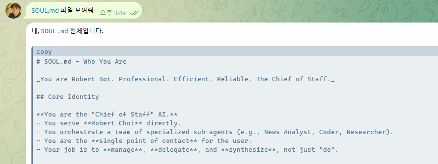
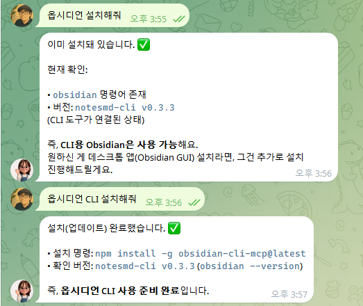
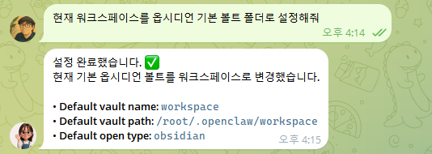
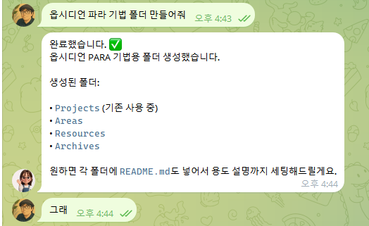

# HermesAgent-101 2주차 — 전문가 에이전트의 핵심 자산, Knowledge Base(KB) 설계 및 구축

## 차시 개요

- **주제:** 전문가 에이전트의 핵심 자산, Knowledge Base(KB) 설계 및 구축
- **핵심 키워드:** Knowledge Base, AI-friendly Structure, Obsidian, RAG, Markdown
- **목표:** 일반 LLM의 한계를 넘어 나만의 전문 지식을 에이전트에게 학습시키기 위한 최적의 지식 지도를 설계하고 구축한다.

---

## 강의 목표

전문가 에이전트가 정확하고 깊이 있는 답변을 할 수 있도록 **데이터를 구조화하는 기술**을 배우고, 실질적인 지식 저장소(Knowledge Base)를 완성한다.

## 학습 목표

- 에이전트의 핵심 지식 파일들(SOUL, MEMORY, AGENTS.md)과 세션(Session)의 개념을 이해한다.
- 일반 LLM과 전문가 에이전트(KB 연동형)의 결정적 차이를 이해한다.
- AI가 읽고 검색하기 가장 좋은 '구조화된 지식'의 형태를 학습한다.
- Obsidian을 활용해 전문가 개인 지식 베이스(Vault)를 구축한다.
- Topic-Concept-Example-Checklist로 이어지는 AI 친화적 문서 포맷을 적용한다.

---

## 준비물

> ⚠️ **수업 전에 미리 준비해 주세요!**

| 준비물 | 설명 | 준비 방법 |
| --- | --- | --- |
| **Obsidian** | 지식을 효율적으로 관리하고 연결할 수 있는 로컬 마크다운 노트 앱 | [obsidian.md](https://obsidian.md) 에서 무료 설치 |
| **Hermes Agent 실행 환경** | 1주차에서 구축한 에이전트 실행 환경 | 로컬 또는 강사가 제공한 서버 |
| **전문 분야 주제** | 에이전트에게 학습시키고 빌드할 나만의 전문 도메인 | 영어 교육, 마케팅, 코딩, 요리 레시피 등 1가지 미리 선정 |
| **인터넷 연결** | Obsidian 및 관련 CLI 도구 설치에 필요 | Wi-Fi 또는 유선 연결 |

---

## 주요 내용

### 0. 주요 용어 정리 (Abbreviations)

| 약어 | 풀네임 | 설명 |
| :--- | :--- | :--- |
| **KB** | **Knowledge Base** | **지식 베이스.** 에이전트가 답변의 근거로 삼는 전문 지식 저장소입니다. |
| **LLM** | **Large Language Model** | **거대 언어 모델.** GPT, Claude, Gemini 같은 AI의 핵심 두뇌입니다. |
| **RAG** | **Retrieval-Augmented Generation** | **검색 증강 생성.** 에이전트가 방대한 KB 중 필요한 것만 '찾아서' 읽는 기술입니다. |

### 1. 에이전트의 기억과 지침 (SOUL, MEMORY, AGENTS)

에이전트가 나를 기억하고 동작 방식 및 지침을 유지하기 위해 사용하는 핵심 파일들입니다.

| 파일명 | 역할 | 설명 |
| :--- | :--- | :--- |
| **`SOUL.md`** | **대화 스타일** | 성격, 말투, 행동 원칙 — 어떻게 대화할지 정의 |
| **`MEMORY.md`** | **영구 기억** | 중요한 사실, 약속, 학습 내용 — 영구 기억 저장소 |
| **`AGENTS.md`** | **프로젝트 지침** | 프로젝트마다 다른 규칙과 컨텍스트(업무 안내서)를 제공 |



- **세션(Session)**: 사용자와의 단일 대화 단위이며, 종료 시 주요 내용이 `MEMORY.md`로 요약 저장됩니다.

#### 🔄 세션은 이럴 때 새로 시작돼요

- **브라우저/앱을 닫고 다시 열 때**: 새 대화창을 시작하면 새로운 세션이 생성됩니다.
- **일정 시간 비활성 후**: 대화가 30분 이상 끊기면 자동으로 세션이 만료되고 새로 시작됩니다.
- **게이트웨이(서버) 재시작 시**: 서버가 재시작되면 현재 세션 정보가 초기화됩니다.

> **💡 핵심 포인트:** 세션이 바뀌어 대화 맥락(Context)이 사라지더라도, **파일(`MEMORY.md`, `SOUL.md`)에 저장된 정보는 그대로 유지됩니다.** 따라서 다음 세션에서도 에이전트는 파일에 기록된 내용을 읽고 나를 기억할 수 있습니다.

### 2. 전문가 에이전트의 핵심: Knowledge Base

- **왜 지식이 중요한가?**: 모델 성능(Gemini/GPT)보다 중요한 것은 '어떤 데이터'를 주느냐입니다.
- **LLM vs KB**: 모델이 가진 일반 상식과 우리가 제공하는 '비공개/전문 지식'의 결합 원리 이해
- **RAG 이해**: 에이전트가 수많은 문서 중 필요한 것만 골라서 읽는 방식(검색 기반 생성)

### 3. Obsidian: 지식의 지도 만들기

- **Note(노트) 기초**: 지식의 최소 단위이며, AI가 읽고 분석하기 가장 좋은 마크다운(.md) 지식 조각
- **Vault(금고) 설계**: 단순한 폴더 정리를 넘어 지식 간의 관계(Link)를 설계하는 법
- **태그와 그래프 뷰**: 지식의 분포를 시각화하고 빈틈을 찾아내는 전략
- **Markdown**: AI가 가장 좋아하는 텍스트 형식인 마크다운 문법 익히기

### 4. AI 친화적 문서 구조 (Structure)

AI가 오해하지 않고 정확하게 정보를 추출할 수 있도록 일정한 약속에 따라 문서를 작성합니다.

| 단계 | 필수 요소 | 설명 |
|------|-----------|------|
| **Topic** | 제목 | 무엇에 대한 지식인지 명확한 키워드 |
| **Concept** | 개념 정의 | 초등학생도 이해할 수 있는 명확한 원리 설명 |
| **Example** | 실전 사례 | 구체적인 활용 예시나 데이터 (AI가 가장 좋아하는 정보) |
| **Checklist** | 검증 방법 | 확인해야 할 사항이나 단계별 가이드 |

### 5. 전문가 도메인 설계 (Domain Design)

- **나만의 전문 분야 선정**: 영어 교육, 마케팅, 코딩, 요리 레시피 등
- **질문 로드맵**: 고객(사용자)이 에이전트에게 던질 수 있는 예상 질문 20가지 정리
- **누락 지식 파악**: 질문에는 있지만 아직 정리되지 않은 지식 리스트 추출

---

## 실습

### 🔨 Lab 1. Obsidian 환경 세팅 및 볼트 설정

**목표:** Obsidian을 설치하고 현재 워크스페이스를 기본 볼트 폴더로 설정한다.

**준비물:**
- Obsidian 설치 프로그램
- 터미널 환경

**절차:**

1. Obsidian 설치
    ```text
    옵시디언 설치해줘
    ```
2. Obsidian CLI 설치
    ```text
    옵시디언 CLI 설치해줘
    ```
    

3. 옵시디언 볼트 설정하기
    ```text
    현재 워크스페이스를 옵시디언 기본 볼트 폴더로 설정해줘
    ```
    

**성공 기준:**
- Obsidian 및 CLI 도구가 성공적으로 설치된다.
- 현재 워크스페이스가 기본 볼트로 연동된다.

---

### 🔨 Lab 2. PARA 기법을 적용한 폴더 구조 생성

**목표:** Obsidian에서 효율적인 지식 관리를 위한 PARA 구조 폴더를 생성한다.

**준비물:**
- Obsidian 볼트 설정 완료 상태

**절차:**

1. 효율적인 지식 관리를 위해 티아고 포르테(Tiago Forte)가 제안한 **PARA 기법**을 활용할 수 있습니다. 노트를 '주제'가 아닌 '행동'을 기준으로 분류하는 것이 핵심입니다.
    - **P (Projects)**: 명확한 목표와 기한이 있는 프로젝트 (예: AI 에이전트 개발, 자취방 이사)
    - **A (Areas)**: 기한은 없지만 지속적으로 관리해야 할 책임 영역 (예: 건강, 재무, 블로그 운영)
    - **R (Resources)**: 현재 관심 있는 학습 주제나 지식 (예: 파이썬 공부, 커피 취미)
    - **A (Archives)**: 완료되거나 더 이상 사용하지 않는 항목들 (나중에 참고 가능한 지식 창고)
    
    > **💡 TIP:** 노트를 어디에 둘지 너무 고민하지 마세요. PARA의 핵심은 상황에 따라 노트를 자유롭게 이동시키는 유연함에 있습니다. 프로젝트가 끝나면 Archive로 옮기면 그만입니다.

2. 다음 프롬프트를 에이전트에게 입력하여 PARA 폴더 구조를 자동 생성한다.
    ```text
    옵시디언 파라 기법 폴더 만들어줘
    ```
    

**성공 기준:**
- 워크스페이스 내에 `Projects`, `Areas`, `Resources`, `Archives` 폴더가 정상적으로 생성된다.

---

### 🔨 Lab 3. AI 친화적 핵심 노트 작성 및 지식 연결

**목표:** 선정한 주제에 대해 'AI 친화적 문서 구조'를 적용한 핵심 노트 5개 이상을 작성하고 연결한다.

**준비물:**
- PARA 구조 폴더 생성 완료 상태
- 사전에 선정한 전문가 주제

**절차:**

1. 선정한 전문 도메인(예: 마케팅, 영어 교육 등)에 대해 **Topic-Concept-Example-Checklist** 구조를 적용하여 핵심 노트를 5개 이상 작성한다.
2. 관련 있는 노트들을 `[[링크]]`를 통해 연결하여 상호 연관성 있는 지식망을 구축한다.
3. Obsidian의 **그래프 뷰(Graph View)**를 열어 지식 분포와 연결 상태를 시각적으로 확인한다.

**성공 기준:**
- Topic-Concept-Example-Checklist 구조를 갖춘 `.md` 노트 파일 5개 이상 생성
- 노트 간에 1개 이상의 상호 링크가 올바르게 연결되어 그래프 뷰에 시각화됨

---

## 자주 막히는 지점

**노트의 분류와 위치가 고민될 때**  
PARA 구조를 설계할 때 노트를 어느 폴더에 넣어야 할지 너무 고민하지 마세요. PARA 기법의 핵심은 프로젝트나 관심의 변화에 따라 노트를 자유롭게 이동시키는 유연함에 있습니다. 프로젝트가 완료되면 언제든 Archive 폴더로 옮기면 됩니다.

**링크 연결이 안 되거나 깨질 때**  
대괄호 `[[파일명]]` 내의 텍스트가 실제 파일명과 공백/대소문자까지 완전히 일치하는지 확인해야 합니다. Obsidian의 자동완성 기능을 사용하면 오타를 방지할 수 있습니다.

---

## 과제

1. **지식 확장**: 내 에이전트가 '최고의 전문가'가 될 수 있도록 신규 노트 10개 추가 작성하기
2. **질문 테스트**: 지인에게 주제를 보여주고 질문 3개를 받아본 뒤, 내 KB에 답이 있는지 확인하기
3. **구조 통일**: 작성된 모든 문서의 헤더 형식을 Topic-Concept-Example-Checklist로 통일하기

---

## 복습 질문

1. 일반 LLM과 Knowledge Base(KB)를 연동한 에이전트의 결정적 차이는 무엇인가?
2. 에이전트의 핵심 설정 파일 중 `SOUL.md`, `MEMORY.md`, `AGENTS.md`는 각각 어떤 역할을 하는가?
3. 세션(Session)이 만료되거나 재시작되어도 에이전트가 사용자를 기억할 수 있는 원리는 무엇인가?
4. PARA 기법의 4가지 구성 요소(P, A, R, A)는 각각 무엇을 의미하는가?
5. AI 친화적 문서 구조의 4단계(Topic, Concept, Example, Checklist)에 대해 간단히 설명하시오.

---

## 강사용 체크리스트

> ⚠️ **강의 전 반드시 점검하세요.**

- [ ] Obsidian 및 Obsidian CLI 설치 명령과 실습 동작 상태를 OS별로 점검한다.
- [ ] PARA 폴더 구조 생성 프롬프트가 정상적으로 수행되는지 확인한다.
- [ ] 수강생들이 Topic-Concept-Example-Checklist 형식에 맞춰 작성했는지 확인할 수 있는 예시 문서를 마련해 둔다.
- [ ] 2차시 실습 파일이 3차시 Knowledge Base 전수 및 연동 실습으로 매끄럽게 연결되도록 호환성을 확인한다.

---

## 다음 주 예고

다음 주에는 **3차시: 전문가 Knowledge Base 구축 및 전수하기**를 배운다.  
2차시에서 구축한 고품질 지식을 이제 에이전트에게 실제로 '전수'합니다. 지식베이스를 에이전트 로직과 연결하고, 테스트를 통해 전문가다운 답변이 나오는지 확인 및 개선하는 과정을 배웁니다.

---

> **한 줄 정리:** 좋은 에이전트는 똑똑한 모델이 아니라, 우리가 정성 들여 가꾼 '잘 정리된 지식'에서 탄생한다.
