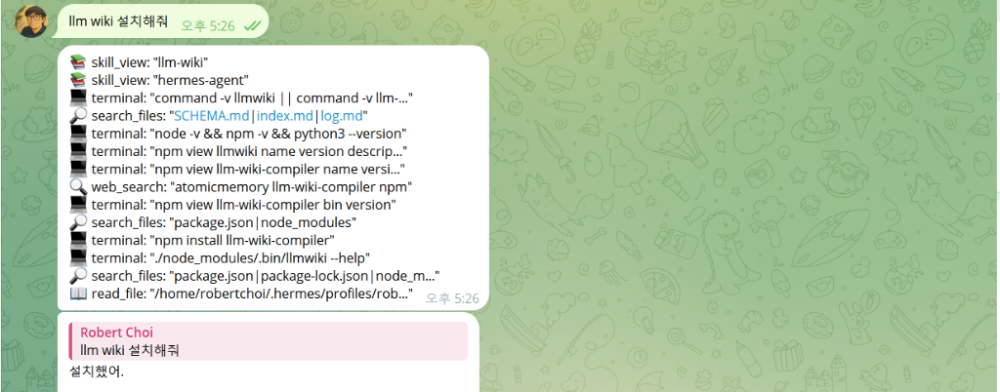
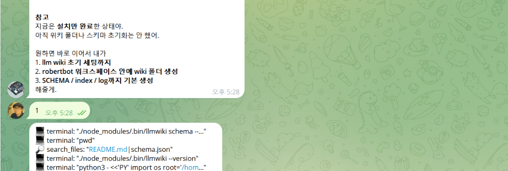

# 2주차. 전문가 에이전트와 LLM Wiki 구축하기

> 2주차 학습 자료(Day 1 ~ Day 6)와 설치 가이드를 하나로 통합한 문서입니다.

## 목차

- [Day 1. 전문가 에이전트 지식 범위 정하기](#day-1-전문가-에이전트-지식-범위-정하기)
- [Day 2. LLM Wiki 뼈대 만들기](#day-2-llm-wiki-뼈대-만들기)
- [Day 3. 첫 원자료 Ingest 하기](#day-3-첫-원자료-ingest-하기)
- [Day 4. 핵심 Wiki 페이지 만들기](#day-4-핵심-wiki-페이지-만들기)
- [Day 5. Wiki 기반 답변 테스트하기](#day-5-wiki-기반-답변-테스트하기)
- [Day 6. Wiki 점검과 운영 매뉴얼 완성하기](#day-6-wiki-점검과-운영-매뉴얼-완성하기)
- [부록. LLM-Wiki 설치 및 초기화 가이드](#llm-wiki-설치-및-초기화-가이드)


---

# Day 1. 전문가 에이전트 지식 범위 정하기

## 오늘의 목표

> **내 전문가 에이전트가 무엇을 잘 답해야 하고, 무엇은 답하지 말아야 하는지 정합니다.**
>
> Knowledge Base를 만들 때 가장 흔한 실수는 자료를 무작정 넣는 것입니다.
> 먼저 전문 분야, 대상, 질문 범위, 원자료를 명확히 정의해야 합니다.

---

## 오늘의 미션

- [ ] 전문가 에이전트의 분야 정하기
- [ ] 이 에이전트가 도와야 할 대상 정하기
- [ ] 자주 답해야 할 질문 20개 적기
- [ ] Knowledge Base에 넣을 원자료 15개 찾기
- [ ] 민감정보와 제외할 자료 정하기

---

## 워크시트 1. 전문가 에이전트 정의하기

* **[전문가 에이전트 이름]**
  
  

* **[전문 분야]**
  * **예시:** AI 자동화 코치, 마케팅 전략 컨설턴트, 수학 학습 코치, 창업 운영 비서, 커뮤니티 운영 코치, 심리상담 콘텐츠 어시스턴트, 법률/세무 정보 정리 보조, 교육 설계 전문가 등
  * **내 에이전트의 전문 분야:**
    
    

* **[이 에이전트가 도와야 하는 사람]**
  1. 
  2. 
  3. 

* **[이 에이전트가 가장 잘 해결해야 하는 문제]**
  1. 
  2. 
  3. 
  4. 
  5. 

* **[이 에이전트가 답하지 말아야 하는 영역]**
  1. 
  2. 
  3. 

* **[한 줄 정의]**
  - 이 에이전트는 __________________________________________ 를 돕는 전문가 에이전트다.

---

## 워크시트 2. 대표 질문 20개 만들기

> 💡 **전문가 Knowledge Base는 “질문”에서 시작하면 좋습니다. 내 에이전트가 자주 답해야 하는 질문을 먼저 정하면, 어떤 자료를 넣어야 할지 명확해집니다.**

### 1. 고객/수강생/독자가 자주 묻는 질문 5개
1. 
2. 
3. 
4. 
5. 

### 2. 내가 자주 설명하는 개념 5개
1. 
2. 
3. 
4. 
5. 

### 3. 상담/컨설팅 전에 확인해야 하는 질문 5개
1. 
2. 
3. 
4. 
5. 

### 4. 콘텐츠로 만들면 좋은 질문 5개
1. 
2. 
3. 
4. 
5. 

---

## 워크시트 3. 원자료 목록 15개 찾기

> 💡 **원자료는 에이전트가 참고할 지식의 출처입니다.**

#### Knowledge Base에 먼저 넣을 원자료 15개

* **자료 유형 예시:** 강의자료 / 워크북 / 상담 기록 / 고객 질문 / FAQ / 블로그 글 / 뉴스레터 / 제안서 / 사례 / 녹취 요약 / 운영 매뉴얼 / 상품 소개서 / 커뮤니티 공지 / 후기 / 체크리스트

1. **자료명:** 
   - 자료 유형: 
   - 현재 위치: 
   - 활용 방식: 

2. **자료명:** 
   - 자료 유형: 
   - 현재 위치: 
   - 활용 방식: 

3. **자료명:** 
   - 자료 유형: 
   - 현재 위치: 
   - 활용 방식: 

4. **자료명:** 
   - 자료 유형: 
   - 현재 위치: 
   - 활용 방식: 

5. **자료명:** 
   - 자료 유형: 
   - 현재 위치: 
   - 활용 방식: 

6. **자료명:** 
   - 자료 유형: 
   - 현재 위치: 
   - 활용 방식: 

7. **자료명:** 
   - 자료 유형: 
   - 현재 위치: 
   - 활용 방식: 

8. **자료명:** 
   - 자료 유형: 
   - 현재 위치: 
   - 활용 방식: 

9. **자료명:** 
   - 자료 유형: 
   - 현재 위치: 
   - 활용 방식: 

10. **자료명:** 
    - 자료 유형: 
    - 현재 위치: 
    - 활용 방식: 

11. **자료명:** 
    - 자료 유형: 
    - 현재 위치: 
    - 활용 방식: 

12. **자료명:** 
    - 자료 유형: 
    - 현재 위치: 
    - 활용 방식: 

13. **자료명:** 
    - 자료 유형: 
    - 현재 위치: 
    - 활용 방식: 

14. **자료명:** 
    - 자료 유형: 
    - 현재 위치: 
    - 활용 방식: 

15. **자료명:** 
    - 자료 유형: 
    - 현재 위치: 
    - 활용 방식: 

---

## 워크시트 4. 민감정보 제외 기준

> 💡 **전문가 KB에는 아무 자료나 넣으면 안 됩니다. 특히 고객 정보, 계약 정보, 계정 정보는 조심해야 합니다.**

### 1. Knowledge Base에 넣지 않을 정보 (체크해 주세요)
- [ ] 비밀번호
- [ ] API 키
- [ ] 인증번호
- [ ] 주민등록번호
- [ ] 카드번호
- [ ] 고객 실명
- [ ] 고객 연락처
- [ ] 계약상 비공개 자료
- [ ] 민감한 상담 내용
- [ ] 회사 내부 기밀
- [ ] 의료/법률/세무 최종 판단
- [ ] 기타: 

### 2. 익명화가 필요한 자료
1. 
2. 
3. 

### 3. 아예 제외할 자료
1. 
2. 
3. 

---

## AI 에이전트에게 보낼 문장

> 💡 **아래 내용을 복사하고 내용을 작성한 후 AI 에이전트에게 보내 조언을 구합니다.**

```text
너는 내 전문가 Knowledge Base 설계 코치다.

나는 아래 분야의 전문가 에이전트를 만들고 싶다.

전문 분야:
____________________________________

도와야 하는 대상:
____________________________________

자주 답해야 하는 질문:
1.
2.
3.
4.
5.

내가 가진 원자료:
1.
2.
3.
4.
5.

이 정보를 바탕으로,
내 Knowledge Base에 먼저 넣어야 할 자료의 우선순위를 정해줘.

답변 형식:
1. 가장 먼저 정리할 원자료 5개
2. 그 이유
3. 만들어야 할 첫 Wiki 페이지 후보 5개
4. 민감정보 주의사항
```

---

## Day 1 인증 양식

```text
[2주차 Day 1 인증]

1. 내 전문가 에이전트 이름:
   - 

2. 전문 분야:
   - 

3. 이 에이전트가 가장 잘 답해야 하는 질문 3개:
   - 
   - 
   - 

4. Knowledge Base에 먼저 넣을 원자료 5개:
   - 
   - 
   - 
   - 
   - 

5. 제외하거나 익명화해야 할 자료:
   - 
   - 
   - 

6. 오늘 만든 한 줄 정의:
   "이 에이전트는 __________________________________________ 를 돕는 전문가 에이전트다."
```


---

# Day 2. LLM Wiki 뼈대 만들기

## 오늘의 목표

> **내 전문가 에이전트가 사용할 LLM Wiki 폴더 구조와 운영 규칙을 만듭니다.**
>
> LLM Wiki의 핵심은 단순히 파일을 모아두는 것이 아닙니다. 에이전트가 어떤 자료를 어디에 넣고, 어떤 페이지를 만들고, 어떻게 링크하고, 언제 업데이트해야 하는지 명확한 운영 규칙을 설계하는 것입니다.
>
> 현재 Hermes Agent의 LLM Wiki 문서도 Wiki를 특별한 데이터베이스가 아니라 **Markdown 파일 디렉터리**로 설명하며, Obsidian 이나 VS Code 같은 텍스트 편집기에서 열어 바로 편집 및 관리할 수 있다고 가이드합니다.

---

## 오늘의 미션

- [ ] 내 LLM Wiki 폴더 구조 만들기
- [ ] 페이지 유형 정하기
- [ ] 태그 체계 만들기
- [ ] SCHEMA.md 초안 작성하기
- [ ] index.md, log.md 역할 정하기

---

## 워크시트 1. LLM Wiki 기본 구조 만들기

> 아래 기본 구조를 확인하고, 내 분야와 필요성에 맞게 폴더 구조를 수정해 봅니다.

### 1. 기본 제공 Wiki 구조 예시
```text
my-expert-wiki/
├── SCHEMA.md
├── index.md
├── log.md
├── raw/
│   ├── lectures/
│   ├── notes/
│   ├── transcripts/
│   ├── client-questions/
│   ├── case-studies/
│   └── assets/
├── concepts/
├── frameworks/
├── faqs/
├── cases/
├── comparisons/
├── offers/
├── audience/
└── queries/
```

### 2. 내가 사용할 구조
```text
my-expert-wiki/
├── SCHEMA.md
├── index.md
├── log.md
├── raw/
│   ├── ____________________
│   ├── ____________________
│   ├── ____________________
│   └── ____________________
├── ____________________
├── ____________________
├── ____________________
├── ____________________
└── ____________________
```

---

## 워크시트 2. 폴더별 역할 정하기

* **`[SCHEMA.md]`**
  - **역할:** 에이전트가 지켜야 할 Knowledge Base 운영 규칙 설정 문서

* **`[index.md]`**
  - **역할:** 전체 Wiki 페이지 목록과 요약 제공

* **`[log.md]`**
  - **역할:** 새 자료 추가, 페이지 생성, 수정 내역 기록 관리

* **`[raw/]`**
  - **역할:** 원자료 보관소. 원본 파일은 절대 수정하지 않고 원본 그대로 유지

* **`[concepts/]`**
  - **역할:** 핵심 개념과 전문 용어 정리

* **`[frameworks/]`**
  - **역할:** 내 전문성을 설명하는 모델, 공식, 절차 및 프레임워크 정리

* **`[faqs/]`**
  - **역할:** 자주 반복되는 고객/사용자 질문과 표준 답변 정리

* **`[cases/]`**
  - **역할:** 실제 상담, 진행 프로젝트, 고객 적용 사례 기록

* **`[queries/]`**
  - **역할:** 축적할 만한 좋은 질문과 이에 대응하는 답변 기록

#### 내 분야에 맞게 추가할 커스텀 폴더:

1. **폴더명:** 
   - **역할:** 

2. **폴더명:** 
   - **역할:** 

3. **폴더명:** 
   - **역할:** 

---

## 워크시트 3. 페이지 유형 정하기

**내 Wiki에서 주로 사용할 페이지 유형을 체크해 보세요.**

- [ ] **개념 페이지** (예: 실행형 AI 비서란 무엇인가)
- [ ] **프레임워크 페이지** (예: AI 비서 업무 범위 3단계)
- [ ] **FAQ 페이지** (예: AI 비서가 이메일을 자동으로 보내도 되나요?)
- [ ] **사례 페이지** (예: 1인기업 대표의 아침 브리핑 자동화 사례)
- [ ] **비교 페이지** (예: 일반 챗봇 vs 실행형 AI 비서)
- [ ] **고객/학습자 유형 페이지** (예: 초보자, 전문가, 1인기업, 팀 운영자)
- [ ] **상품/서비스 페이지** (예: 6일 챌린지, 컨설팅 패키지, 워크숍)
- [ ] **질문 응답 기록 페이지** (예: 좋은 질문과 검증된 답변 저장)
- [ ] **용어집 페이지** (예: Agent, Skill, Memory, Cron, Heartbeat)

#### 내 Wiki에 반드시 필요한 핵심 페이지 유형 5개:
1. 
2. 
3. 
4. 
5. 

---

## 워크시트 4. 태그 체계 만들기

### 1. 대상 태그 (Audience)
* **예시:** `#초보자`, `#전문가`, `#1인기업`, `#창업가`, `#강사`, `#컨설턴트`, `#팀운영자`
* **내가 사용할 대상 태그:**
  1. 
  2. 
  3. 
  4. 
  5. 

### 2. 콘텐츠 유형 태그 (Type)
* **예시:** `#개념`, `#FAQ`, `#사례`, `#프레임워크`, `#비교`, `#스크립트`, `#워크플로우`
* **내가 사용할 콘텐츠 유형 태그:**
  1. 
  2. 
  3. 
  4. 
  5. 

### 3. 상태 태그 (Status)
* **예시:** `#초안`, `#검증됨`, `#업데이트필요`, `#확인필요`, `#민감정보주의`
* **내가 사용할 상태 태그:**
  1. 
  2. 
  3. 
  4. 
  5. 

---

## 워크시트 5. SCHEMA.md 초안

> 💡 **아래 템플릿 내용을 복사하여 내 위키 최상위 경로의 `SCHEMA.md` 파일로 작성합니다.**

````markdown
# SCHEMA.md
# 전문가 Knowledge Base 운영 규칙

## 1. Domain

이 Wiki는 다음 분야를 다룬다.

- **분야:** ____________________________________
- **이 Wiki의 목적:** ____________________________________
- **이 Wiki를 사용하는 에이전트의 역할:** ____________________________________


## 2. Audience

이 Wiki의 주요 대상은 다음과 같다.

1. 
2. 
3. 


## 3. Source Rules

원자료는 `raw/` 폴더에 보관한다.

- 원자료는 수정하지 않는다.
- 원자료에서 추출한 지식은 Wiki 페이지에 별도로 정리한다.
- 출처가 불분명한 내용은 확정된 사실처럼 기재하지 않는다.
- 민감한 개인정보, 비밀번호, API 키, 계약상 기밀정보는 Wiki에 절대 기입하지 않는다.


## 4. Page Types

이 Wiki에서 사용할 폴더별 페이지 유형은 다음과 같다.

1. **`concepts/`** : 개념, 용어, 핵심 아이디어
2. **`frameworks/`** : 공식, 모델, 절차, 방법론
3. **`faqs/`** : 반복 질문과 검증된 답변
4. **`cases/`** : 실제 사례, 고객 사례, 프로젝트 사례
5. **`comparisons/`** : 개념, 도구, 전략 비교
6. **`queries/`** : 보존할 가치가 있는 대화 질문과 답변


## 5. Naming Rules

- 파일명은 영어 소문자와 하이픈(-)만 사용한다. (예: `ai-assistant-scope.md`)
- 한국어 제목은 페이지 맨 위 H1 헤더로 표시한다. (예: `# AI 비서 업무 범위 정하기`)


## 6. Frontmatter Rules

모든 Wiki 페이지는 최상단에 아래 메타데이터를 포함한다.

```markdown
---
title: 
type: 
tags: 
source: 
created: 
updated: 
status: 
---
```


## 7. Link Rules

- 모든 핵심 페이지는 최소 2개 이상의 관련 페이지와 내부 링크(`[[파일명]]`)로 연결한다.
- 새 페이지를 생성하기 전, 기존 페이지가 중복으로 존재하지 않는지 먼저 검색하여 확인한다.
- 중복되는 주제가 있다면 새 페이지를 만드는 대신 기존 페이지에 통합하여 업데이트한다.


## 8. Evidence Rules

- 출처가 있는 지식 내용과 작성자(에이전트)의 자체 해석을 엄격히 구분한다.
- **출처가 있는 지식:** 원자료명 또는 원본 파일명을 명시적으로 남긴다.
- **주관적 해석:** "해석", "가설", "운영자 판단"이라는 키워드로 명확히 감싸 표시한다.
- **확인되지 않은 지식:** "확인 필요" 마크를 삽입한다.


## 9. Safety Rules

아래 민감 정보들은 Wiki에 포함할 수 없다.
- 비밀번호 / API 키 / 인증번호
- 주민등록번호 등 식별 가능한 고유 개인정보
- 고객 사생활 정보 및 비공개 이메일/대화 기록
- 계약 관계상 외부 유출이 불가능한 사내 기밀 자료
- 법률, 의료, 세무 판단을 확정하는 최종 결정 정보

AI는 준비 과정을 돕고, 최종 판단과 행동 실행은 사람이 승인한다.
````

---

## AI 에이전트에게 보낼 문장

> 💡 **아래 양식을 채워 AI 에이전트에게 전송하고 피드백을 받습니다.**

```text
아래 정보를 바탕으로 내 전문가 LLM Wiki의 SCHEMA.md 초안을 정리해줘.

전문 분야:
____________________________________

주요 대상:
____________________________________

내가 사용할 폴더 구조:
____________________________________

주요 페이지 유형:
____________________________________

태그 체계:
____________________________________

주의할 보안 규칙:
____________________________________

답변 형식:
1. SCHEMA.md 초안
2. index.md에 들어갈 초기 섹션
3. log.md 첫 기록 예시
4. 지금 구조에서 빠진 점
```

---

## Day 2 인증 양식

```text
[2주차 Day 2 인증]

1. 내가 만든 Wiki 구조:
   - 

2. 반드시 사용할 페이지 유형 5개:
   - 
   - 
   - 
   - 
   - 

3. 내가 정한 태그 5개:
   - 
   - 
   - 
   - 
   - 

4. SCHEMA.md에서 가장 중요한 규칙 3개:
   - 
   - 
   - 

5. 오늘 만든 결과물:
   - [ ] 폴더 구조 세팅
   - [ ] SCHEMA.md 초안 작성
   - [ ] index.md 초안 작성
   - [ ] log.md 초안 작성
```


---

# Day 3. 첫 원자료 Ingest 하기

## 오늘의 목표

> **오늘은 원자료 1개를 골라 LLM Wiki에 넣는 첫 번째 Ingest(수집 및 처리)를 진행합니다.**
>
> Ingest는 단순 요약이 아닙니다. 원자료를 깊이 있게 분석하고, 핵심 지식을 추출하고, 관련 개념과 FAQ를 체계화하여 필요한 다른 위키 페이지들과 연결하는 전체 구조 설계 과정입니다.

---

## 오늘의 미션

- [ ] 첫 번째 원자료 1개 선택하기
- [ ] 원자료 메타데이터 작성하기
- [ ] 민감정보 제거 또는 익명화하기
- [ ] 요약 페이지 만들기
- [ ] 연결할 Wiki 페이지 후보 정하기
- [ ] `log.md`에 작업 기록 남기기

---

## 워크시트 1. 첫 원자료 선택하기

### 1. 오늘 Ingest할 원자료 정보

* **자료명:** 
  
  
* **자료 위치:** 
  
  
* **이 자료를 먼저 넣는 이유:** 
  
  
* **이 자료가 답할 수 있는 질문:**
  1. 
  2. 
  3. 

### 2. 자료 유형 (해당하는 항목에 체크해 주세요)

- [ ] 강의자료
- [ ] 상담 기록
- [ ] 고객 질문
- [ ] 블로그 글
- [ ] 뉴스레터
- [ ] 제안서
- [ ] 사례
- [ ] 회의록
- [ ] 녹취 요약
- [ ] 운영 매뉴얼
- [ ] 기타: 

---

## 워크시트 2. 원자료 정리 카드

### [Source Card]

```yaml
title: 
type: 
source_location: 
created_date: 
owner: 
sensitivity: 
status: 
```

* **핵심 주제:** 
  
  
* **주요 대상:** 
  
  

* **중요도:**
  - [ ] 상
  - [ ] 중
  - [ ] 하

* **민감정보 포함 여부:**
  - [ ] 없음
  - [ ] 있음

* **익명화 필요 내용:**
  1. 
  2. 
  3. 

---

## 워크시트 3. Ingest 프롬프트

> 💡 **아래 양식을 복사하고 괄호(`___`) 영역을 작성하여 AI 에이전트에게 전달해 Ingest 분석을 진행합니다.**

```text
아래 원자료를 내 전문가 LLM Wiki에 추가하기 위한 Ingest 작업을 해줘.

작업 규칙:
1. 원자료 자체는 수정하지 마.
2. 핵심 내용을 요약해줘.
3. 새로 만들 필요가 있는 Wiki 페이지를 제안해줘.
4. 기존 페이지와 연결될 수 있는 항목을 찾아줘.
5. FAQ로 저장할 만한 질문과 답변을 뽑아줘.
6. 프레임워크나 사례 페이지로 발전시킬 수 있는 내용을 표시해줘.
7. 출처가 불명확한 내용은 “확인 필요”로 표시해줘.
8. 민감정보가 있으면 익명화 필요로 표시해줘.
9. 최종 업데이트 전에 어떤 페이지를 만들거나 수정할지 먼저 목록으로 보여줘.

원자료 제목:
____________________________________

원자료 내용:
____________________________________
```

---

## 워크시트 4. Ingest 결과 기록

### [Ingest 결과]

* **원자료 제목:** 
  
  

* **핵심 요약 5줄:**
  1. 
  2. 
  3. 
  4. 
  5. 

* **새로 만들 Wiki 페이지 후보:**
  1. 
  2. 
  3. 
  4. 
  5. 

* **업데이트할 기존 페이지 후보:**
  1. 
  2. 
  3. 

* **FAQ 후보:**
  - **1. 질문:** 
    - 답변 초안: 
  - **2. 질문:** 
    - 답변 초안: 
  - **3. 질문:** 
    - 답변 초안: 

* **확인 필요 내용:**
  1. 
  2. 
  3. 

---

## 워크시트 5. log.md 기록

> 💡 **아래 템플릿 구조를 기반으로 위키의 `log.md` 파일에 기록을 누적합니다.**

```markdown
## YYYY-MM-DD

### 작업: 
첫 원자료 Ingest

### 원자료:
- ____________________________________

### 생성한 페이지:
- 
- 
- 

### 업데이트한 페이지:
- 
- 

### 확인 필요 사항:
- 
- 

### 다음 작업:
- 
```

---

## Day 3 인증 양식

```text
[2주차 Day 3 인증]

1. 오늘 Ingest한 원자료:
   - 

2. 원자료 유형:
   - 

3. 핵심 요약 3줄:
   - 
   - 
   - 

4. 새로 만들 Wiki 페이지 후보 3개:
   - 
   - 
   - 

5. FAQ 후보 3개:
   - 
   - 
   - 

6. 확인 필요 또는 익명화 필요 내용:
   - 
   - 
   - 
```


---

# Day 4. 핵심 Wiki 페이지 만들기

## 오늘의 목표

> **전문가 에이전트가 실제로 조회하고 참고할 수 있는 핵심 Wiki 페이지들을 생성합니다.**
>
> 처음부터 많은 페이지를 작성하기보다는 앞으로 계속 확장하고 가지를 뻗어 나갈 수 있는 튼튼한 씨앗 페이지(Seed Page) 5개를 제대로 구축하는 데 집중합니다.

---

## 오늘의 미션

- [ ] 개념 페이지 1개 만들기
- [ ] 프레임워크 페이지 1개 만들기
- [ ] FAQ 페이지 1개 만들기
- [ ] 사례 페이지 1개 만들기
- [ ] 비교 페이지 또는 Query 페이지 1개 만들기
- [ ] 페이지 간 링크 연결하기

---

## 워크시트 1. 오늘 만들 Seed Page 5개

#### 1. 첫 번째 페이지
- **페이지 제목:** 
- **페이지 유형:** 
- **들어갈 내용:** 
- **연결할 원자료:** 

#### 2. 두 번째 페이지
- **페이지 제목:** 
- **페이지 유형:** 
- **들어갈 내용:** 
- **연결할 원자료:** 

#### 3. 세 번째 페이지
- **페이지 제목:** 
- **페이지 유형:** 
- **들어갈 내용:** 
- **연결할 원자료:** 

#### 4. 네 번째 페이지
- **페이지 제목:** 
- **페이지 유형:** 
- **들어갈 내용:** 
- **연결할 원자료:** 

#### 5. 다섯 번째 페이지
- **페이지 제목:** 
- **페이지 유형:** 
- **들어갈 내용:** 
- **연결할 원자료:** 

---

## 워크시트 2. 공통 Wiki 페이지 템플릿

> 💡 **가장 표준이 되는 공통 페이지 템플릿입니다. 복사해서 기본 페이지 생성 시 활용하세요.**

````markdown
---
title: 
type: 
tags: 
source: 
created: 
updated: 
status: 
---

# 페이지 제목

## 1. 한 줄 요약


## 2. 핵심 내용


## 3. 왜 중요한가


## 4. 적용 사례


## 5. 관련 페이지
- [[관련 페이지 1]]
- [[관련 페이지 2]]


## 6. 출처
- 원자료: 


## 7. 확인 필요
- 
````

---

## 워크시트 3. 개념 페이지 템플릿

> 💡 **특정 지식의 개념이나 원리를 정의하고 설명하는 페이지 템플릿입니다.**

````markdown
---
title: 
type: concept
tags: 
source: 
created: 
updated: 
status: 
---

# 개념명

## 한 줄 정의


## 쉽게 설명하면


## 전문가 관점에서 중요한 이유


## 자주 생기는 오해


## 적용 예시


## 관련 질문
1. 
2. 
3. 


## 관련 페이지
- [[ ]]
- [[ ]]
````

---

## 워크시트 4. 프레임워크 페이지 템플릿

> 💡 **실행 절차, 설계 모델, 방법론 등을 도식화하거나 설명하는 페이지 템플릿입니다.**

````markdown
---
title: 
type: framework
tags: 
source: 
created: 
updated: 
status: 
---

# 프레임워크 이름

## 한 줄 설명


## 언제 사용하는가


## 단계
1. 
2. 
3. 
4. 
5. 


## 예시


## 주의할 점


## 관련 사례
- [[ ]]


## 관련 FAQ
- [[ ]]
````

---

## 워크시트 5. FAQ 페이지 템플릿

> 💡 **자주 묻는 질문과 검증된 정밀 답변 및 대응 초안을 다루는 페이지 템플릿입니다.**

````markdown
---
title: 
type: faq
tags: 
source: 
created: 
updated: 
status: 
---

# FAQ 제목

## 질문


## 짧은 답변


## 자세한 답변


## 근거가 되는 자료


## 고객/수강생에게 보낼 답변 초안


## 확인 필요


## 관련 페이지
- [[ ]]
- [[ ]]
````

---

## 워크시트 6. 사례 페이지 템플릿

> 💡 **구체적인 실무 문제 해결 내용 및 케이스 스터디를 작성하는 페이지 템플릿입니다.**

````markdown
---
title: 
type: case
tags: 
source: 
created: 
updated: 
status: 
---

# 사례 제목

## 배경


## 문제


## 적용한 방법


## 결과


## 배운 점


## 재사용 가능한 패턴


## 민감정보 익명화 여부
- [ ] 완료
- [ ] 필요


## 관련 페이지
- [[ ]]
- [[ ]]
````

---

## 워크시트 7. 링크 지도 만들기

> 💡 **페이지 간 고립되는 지식이 없도록 서로 유기적으로 연결되는 지도를 설계해 봅니다.**

#### [페이지 연결 지도]

* **페이지 1:** 
  - 연결할 페이지:
    - 
    - 

* **페이지 2:** 
  - 연결할 페이지:
    - 
    - 

* **페이지 3:** 
  - 연결할 페이지:
    - 
    - 

* **페이지 4:** 
  - 연결할 페이지:
    - 
    - 

* **페이지 5:** 
  - 연결할 페이지:
    - 
    - 

---

## AI 에이전트에게 보낼 문장

> 💡 **아래 내용을 복사하고 괄호(`___`) 부분을 보완하여 AI 에이전트에게 전송합니다.**

```text
오늘 만들 Seed Wiki 페이지 5개를 작성해줘.

규칙:
1. 각 페이지는 Markdown 형식으로 작성한다.
2. 모든 페이지에는 frontmatter를 포함한다.
3. 출처가 있는 내용과 내 해석을 구분한다.
4. 확인이 필요한 내용은 “확인 필요”로 표시한다.
5. 각 페이지는 최소 2개 이상의 관련 페이지와 연결한다.
6. 고객에게 바로 보낼 표현은 초안으로만 작성한다.

오늘 만들 페이지:
1.
2.
3.
4.
5.

참고 원자료:
____________________________________
```

---

## Day 4 인증 양식

```text
[2주차 Day 4 인증]

1. 오늘 만든 Wiki 페이지 5개:
   - 
   - 
   - 
   - 
   - 

2. 가장 중요한 페이지 1개:
   - 

3. 그 이유:
   - 

4. 페이지 간 연결한 링크:
   - 
   - 
   - 

5. 확인 필요로 남긴 내용:
   - 
   - 
   - 
```


---

# Day 5. Wiki 기반 답변 테스트하기

## 오늘의 목표

> **구축한 Knowledge Base(지식 베이스)가 에이전트의 답변 정확도를 실제로 개선하는지 테스트합니다.**
>
> 훌륭한 Knowledge Base는 단순히 예쁜 문서 모음이 아니라, 에이전트가 사용자의 구체적인 전문 질문에 더욱 정확하고 일관된 답을 하도록 가이드하는 실질적인 시스템입니다.
>
> 오늘은 실제 예상 질문을 던지고, Wiki 기반 답변을 구성하는 프로세스를 진행한 뒤 유용한 완성본 답변을 `queries/` 또는 `faqs/` 폴더에 저장합니다.

---

## 오늘의 미션

- [ ] 실제 예상 질문 10개 선정하기
- [ ] Wiki 기반 답변 규칙 확인 및 숙지하기
- [ ] 질문 3개 이상으로 에이전트 답변 테스트 실행하기
- [ ] 에이전트 답변 품질 평가하기
- [ ] 고품질 답변을 Query 또는 FAQ 페이지로 이관 및 저장하기

---

## 워크시트 1. 테스트 질문 10개

#### 내 전문가 에이전트에게 검증해 볼 질문 10가지

1. 
2. 
3. 
4. 
5. 
6. 
7. 
8. 
9. 
10. 

---

## 워크시트 2. Wiki 기반 답변 규칙

**나의 전문가 에이전트는 사용자의 질문에 답할 때 다음 동작 규칙을 철저히 준수합니다.**

1. 가장 먼저 Knowledge Base 내의 관련 위키 페이지가 존재하는지 파악하고 참고한다.
2. 사실에 기반하여 확실히 근거가 명시된 정보와 에이전트의 자체 추론을 구별하여 설명한다.
3. 근거가 되는 출처 지식이 모호하거나 없을 경우, 단정지어 답변하지 않는다.
4. 고객/수강생 등 사용자에게 즉각 보낼 수 있는 완성도 높은 답변 초안을 구성한다.
5. 민감한 결정이나 법적/경제적 판단과 같이 리스크가 큰 영역은 임의로 결정하지 않고 승인을 요청한다.
6. 충분히 검증된 고품질 답변은 향후 `queries/` 또는 `faqs/` 폴더에 학습시킬 후보군으로 제안한다.

---

## 워크시트 3. 답변 형식 템플릿

> 💡 **에이전트가 답변을 준비할 때 출력할 기본 포맷 서식입니다.**

```markdown
# 질문: ____________________________________

## 1. 핵심 답변


## 2. 근거가 되는 Wiki 페이지
- [[페이지명]]
- [[페이지명]]


## 3. 적용 예시


## 4. 확인 필요 사항


## 5. 고객/수강생에게 보낼 답변 초안


## 6. 저장 여부
- [ ] FAQ로 저장
- [ ] Query로 저장
- [ ] 저장하지 않음
- [ ] 추가 자료 필요
```

---

## 워크시트 4. 테스트 프롬프트

> 💡 **아래 안내 프롬프트 양식을 복사하여 에이전트에게 질문할 때 함께 전송합니다.**

```text
아래 질문에 답해줘.

질문:
____________________________________

답변 규칙:
1. 내 Knowledge Base / LLM Wiki를 우선 참고해.
2. 관련 Wiki 페이지가 있다면 먼저 표시해.
3. 근거가 있는 내용과 추론을 구분해.
4. 근거가 부족하면 “확인 필요”라고 표시해.
5. 고객에게 보낼 수 있는 답변 초안을 만들어줘.
6. 이 답변을 FAQ 또는 queries에 저장할 가치가 있는지 판단해줘.
```

---

## 워크시트 5. 답변 품질 점검표

### [답변 품질 점검]

* **질문:** 
  
  
* **AI 답변 요약:** 
  
  

#### 품질 항목 자가진단 (체크해 주세요)

* **관련 Wiki 페이지를 정상적으로 참고했는가?**
  - [ ] 예
  - [ ] 아니오

* **근거와 에이전트의 임의 추론을 명확히 구분했는가?**
  - [ ] 예
  - [ ] 아니오

* **내가 의도하는 지식의 톤앤매너와 정확히 부합하는가?**
  - [ ] 예
  - [ ] 일부 수정 필요
  - [ ] 아니오

* **고객/수강생에게 추가 편집 없이 바로 보내도 될 정도인가?**
  - [ ] 가능
  - [ ] 수정 필요
  - [ ] 보내면 안 됨

* **정보 부족에 대한 "확인 필요" 마킹이 올바르게 표시되었는가?**
  - [ ] 예
  - [ ] 아니오

* **향후 저장하여 재학습시킬 위치:**
  - [ ] faqs/ (자주 묻는 핵심 문답)
  - [ ] queries/ (사례 중심 디테일 문답)
  - [ ] cases/ (구체적 에피소드 사례)
  - [ ] 저장하지 않음

---

## 워크시트 6. Query 저장 템플릿

> 💡 **에이전트가 훌륭하게 답변한 내용은 아래 템플릿에 맞추어 `queries/` 폴더에 새 파일로 영구 보관합니다.**

````markdown
---
title: 
type: query
tags: 
source: 
created: 
updated: 
status: 
---

# 질문 제목

## 원 질문


## 최종 답변


## 참고한 Wiki 페이지
- [[ ]]
- [[ ]]


## 답변 품질 메모


## 다음 업데이트 필요 사항


## 관련 FAQ
- [[ ]]
````

---

## Day 5 인증 양식

```text
[2주차 Day 5 인증]

1. 테스트한 질문 3개:
   - 
   - 
   - 

2. 가장 답변이 잘 나온 질문:
   - 

3. 답변이 부족했던 질문:
   - 

4. 추가로 필요한 원자료:
   - 

5. FAQ 또는 Query로 저장할 답변:
   - 
   - 
   - 
```


---

# Day 6. Wiki 점검과 운영 매뉴얼 완성하기

## 오늘의 목표

> **2주차 동안 만든 LLM Wiki를 점검하고, 앞으로 30일 동안 지식을 축적해 나갈 운영 매뉴얼을 완성합니다.**
>
> Knowledge Base는 한 번 만들고 끝나는 일회성 자료집이 아닙니다. 질문이 들어올 때마다, 상담이 끝날 때마다, 유용한 콘텐츠를 작성할 때마다 지속적으로 업데이트하고 수정하며 성장시켜야 하는 생물과 같습니다.

---

## 오늘의 미션

- [ ] Wiki 구조 점검하기
- [ ] 중복 페이지와 고립 페이지 찾기
- [ ] 출처와 확인 필요 내용 점검하기
- [ ] 보안과 민감정보 점검하기
- [ ] 전문가 KB 운영 매뉴얼 작성하기
- [ ] 30일 업데이트 계획 세우기

---

## 워크시트 1. Wiki 구조 점검표

**내 위키의 기초 필수 요소들이 정상 배치되어 있는지 확인합니다.**

- [ ] `SCHEMA.md` 파일이 존재하고 정의되어 있다.
- [ ] `index.md` 파일이 존재하고 페이지 목록이 링크되어 있다.
- [ ] `log.md` 파일이 존재하고 변경 이력이 시작되었다.
- [ ] `raw/` 폴더가 생성되어 있다.
- [ ] `concepts/` 폴더가 생성되어 있다.
- [ ] `frameworks/` 폴더가 생성되어 있다.
- [ ] `faqs/` 폴더가 생성되어 있다.
- [ ] `cases/` 폴더가 생성되어 있다.
- [ ] `queries/` 폴더가 생성되어 있다.
- [ ] 각 폴더별 용도와 에이전트의 역할이 명확하다.

---

## 워크시트 2. 페이지 품질 점검표

**개별 위키 페이지가 지켜야 할 품질 가이드를 충족하는지 체크합니다.**

- [ ] 모든 페이지에 적절한 제목(H1)이 작성되어 있다.
- [ ] 모든 페이지 프런트매터에 `type` 필드가 정의되어 있다.
- [ ] 모든 페이지 프런트매터에 관련 `tags`가 입력되어 있다.
- [ ] 해당 정보의 출처(Source)가 링크 혹은 텍스트로 보존되어 있다.
- [ ] 확실하지 않은 지식 영역에 "확인 필요" 표시가 명시되어 있다.
- [ ] 최소 2개 이상의 관련 페이지와 상호 내부 링크가 맺어져 있다.
- [ ] 내용상 중복되는 페이지가 없이 고유한 정보를 담고 있다.
- [ ] 최신화가 필요한 오래된 지식은 `status: 업데이트필요` 태그 등으로 관리되고 있다.

---

## 워크시트 3. 중복/고립/충돌 점검

#### 1. 중복 페이지 후보 (통합이 필요한 페이지들)
1. 
2. 
3. 

#### 2. 고립 페이지 후보 (다른 페이지와 내부 링크 연결이 누락된 페이지들)
1. 
2. 
3. 

#### 3. 충돌 정보 (기존 원자료와 새 정보가 상충하는 항목)
* **사례 1:**
  - 기존 주장: 
  - 새 주장: 
  - 출처: 
  - 처리 방식: 

* **사례 2:**
  - 기존 주장: 
  - 새 주장: 
  - 출처: 
  - 처리 방식: 

---

## 워크시트 4. 보안 점검표

**Knowledge Base 유출이나 프롬프트 인젝션 시 발생할 개인정보/보안 유출 위험을 진단합니다.**

- [ ] 고객의 실제 성명이나 고유 식별 명칭을 익명화 처리했다.
- [ ] 연락처, 이메일 주소, 집 주소 등의 개인정보를 제거했다.
- [ ] 비밀번호, API 키, 금융 인증 토큰 등의 민감 계정 정보가 적혀있지 않다.
- [ ] 계약서 원본이나 외부 비공개 보증 조항 등 비밀보호 자료를 필터링하여 배제했다.
- [ ] 내밀한 고객 상담 요약본을 대명사나 가칭을 사용해 익명화했다.
- [ ] 에이전트가 고객에게 보낼 메시지는 원본이 아닌 '초안 템플릿' 형태로만 가공해 저장했다.
- [ ] 가격, 환불, 신규 계약 동의와 같은 중요 결제 관련 답변에는 "승인 필요" 처리를 명시했다.
- [ ] 의료/법률/세무와 같이 전문 면허가 수반되어야 하는 최종 의사결정은 에이전트의 역할에서 완전히 차단했다.

---

## 워크시트 5. 전문가 KB 운영 매뉴얼

> 💡 **아래 양식을 채워 내 전문가 지식 저장소를 장기적으로 운영할 나만의 규칙 매뉴얼로 보관합니다.**

# 전문가 Knowledge Base 운영 매뉴얼

### 1. Knowledge Base 이름
- 

### 2. 목적
- 이 Knowledge Base는 __________________________________________ 를 목적으로 사용한다.

### 3. 사용하는 에이전트
- **에이전트 이름:** 
- **에이전트 역할:** 

### 4. 주요 대상
1. 
2. 
3. 

### 5. 주요 폴더 구조
```text
my-expert-wiki/
├── SCHEMA.md
├── index.md
├── log.md
├── raw/
├── concepts/
├── frameworks/
├── faqs/
├── cases/
└── queries/
```

### 6. 새 자료가 들어왔을 때 처리 순서
1. 원본 문서를 `raw/`에 보관한다.
2. 민감정보나 개인정보 포함 여부를 스캔하고 필요시 익명화한다.
3. 문서의 핵심 요약을 도출한다.
4. 관련 있는 기존 Wiki 페이지를 식별한다.
5. 새 위키 페이지를 작성하거나 기존 페이지를 업데이트한다.
6. `index.md`에 새 페이지 링크를 추가한다.
7. `log.md`에 추가 내역 및 날짜를 기록한다.

### 7. 질문이 들어왔을 때 처리 순서
1. 질문과 연관된 Wiki 페이지를 색인 검색한다.
2. 사실 지식과 에이전트의 추론 지식을 구분하여 정리한다.
3. 정보 부족 시 "확인 필요" 태그를 명시한다.
4. 사용자에게 전송할 고정 형태의 답변 초안을 구성한다.
5. 유용한 문답일 경우 향후 지식 고도화를 위해 `faqs/` 또는 `queries/`에 이관한다.

### 8. 승인 필요 작업
- 아래 중요 행동은 에이전트가 단독 결정할 수 없으며 반드시 사람의 서면/구두 승인이 수반되어야 한다.
1. 
2. 
3. 
4. 
5. 

### 9. 업데이트 주기
- **매일:** ____________________________________
- **매주:** ____________________________________
- **매월:** ____________________________________

---

## 워크시트 6. 30일 운영 계획

#### [1주차 목표: 원자료 5개 Ingest하기]
* **자료 후보:**
  1. 
  2. 
  3. 
  4. 
  5. 

#### [2주차 목표: 핵심 개념 페이지 10개 만들기]
* **개념 페이지 후보:**
  1. 
  2. 
  3. 
  4. 
  5. 

#### [3주차 목표: FAQ와 사례 페이지 만들기]
* **FAQ 후보:**
  1. 
  2. 
  3. 
  4. 
  5. 
* **사례 후보:**
  1. 
  2. 
  3. 

#### [4주차 목표: 답변 품질 개선하기]
* **점검 항목:**
  1. 생성된 에이전트 답변이 설계자인 내 관점과 정확히 일치하는가?
  2. 사실 지식 이외에 검증 불가능한 거짓(환각 현상)을 주장하지 않는가?
  3. 사용자에게 즉시 전송해도 지장이 없을 수준으로 가독성과 신뢰성이 높은가?
  4. 위험이 동반되는 승인 필요 작업을 명확히 인지하고 나에게 피드백하는가?
  5. 지속적으로 유입되는 고객의 반복 질문을 Wiki 데이터베이스에 성실히 축적하고 있는가?

---

## 워크시트 7. 향후 자동화 후보

> 💡 **2주차에 에이전트 자동화 연동을 바로 완성할 필요는 없습니다. 다만 추후 OpenClaw나 Hermes Agent의 자동화 프로세스로 위임할 반복 지식 업무 후보를 미리 진단하고 정리해 둡니다.**

1. **새 고객 질문이 유입되면 자동으로 FAQ 후보로 정리하기**
   - 자동화 적합도: [ ] 높음  /  [ ] 중간  /  [ ] 낮음

2. **매주 금요일마다 `log.md` 기록 자동 요약 보고하기**
   - 자동화 적합도: [ ] 높음  /  [ ] 중간  /  [ ] 낮음

3. **새로운 고객 상담 기록을 익명화하여 `cases/` 임시 후보군 폴더로 정렬하기**
   - 자동화 적합도: [ ] 높음  /  [ ] 중간  /  [ ] 낮음

4. **생성일자가 오래되어 최신화가 시급한 문서를 자동으로 '업데이트 필요' 분류하기**
   - 자동화 적합도: [ ] 높음  /  [ ] 중간  /  [ ] 낮음

5. **최근 잦은 질문 데이터를 마케팅/콘텐츠 기획서 아이디어로 자동 가공하기**
   - 자동화 적합도: [ ] 높음  /  [ ] 중간  /  [ ] 낮음

---

## AI 에이전트에게 보낼 점검 프롬프트

> 💡 **아래 점검 가이드를 복사하여 AI 에이전트에게 질문하고 Wiki 지식 설계의 피드백을 수집합니다.**

```text
내 전문가 LLM Wiki를 점검해줘.

점검 기준:
1. SCHEMA.md 규칙을 지키고 있는가
2. index.md에 주요 페이지가 정리되어 있는가
3. log.md에 작업 기록이 남아 있는가
4. 중복 페이지가 있는가
5. 고립 페이지가 있는가
6. 출처 없는 주장이 있는가
7. 확인 필요 내용이 표시되어 있는가
8. 민감정보가 포함되어 있는가
9. FAQ나 queries로 저장할 가치가 있는 답변이 있는가
10. 다음 30일 동안 무엇을 우선 업데이트해야 하는가

답변 형식:
1. 전체 상태 요약
2. 잘 된 점
3. 수정할 점
4. 위험하거나 확인이 필요한 부분
5. 다음 7일 실행 계획
```

---

## Day 6 인증 양식

```text
[2주차 Day 6 인증]

1. 내 Knowledge Base 이름:
   - 

2. 현재 만든 핵심 페이지 수:
   - 

3. 가장 중요한 Wiki 페이지 3개:
   - 
   - 
   - 

4. 수정이 필요한 점:
   - 
   - 
   - 

5. 보안상 조심해야 할 점:
   - 
   - 
   - 

6. 30일 운영 계획 한 줄:
   "앞으로 30일 동안 나는 __________________________________________ 를 축적한다."

7. 다음 주에 가장 먼저 할 일:
   - 
```


---

# LLM-Wiki 설치 및 초기화 가이드

이 문서는 에이전트를 위한 지식 저장소(Knowledge Base) 컴파일러인 **LLM-Wiki (`llm-wiki-compiler`)**를 설치하고 프로젝트 워크스페이스 내에 초기 위키 구조를 구성하는 방법에 대해 다룹니다. 에이전트가 수행한 실제 설치 및 초기화 로그를 바탕으로 작성되었습니다.

---

## 📋 사전 준비 사항

LLM-Wiki 컴파일러는 Node.js 환경에서 동작합니다. 설치를 진행하기 전에 로컬 환경에 아래 도구들이 설치되어 있는지 확인합니다.

- **Node.js** (v18 이상 권장)
- **NPM** (Node Package Manager)
- **Python 3** (종속성 빌드용)

> [!TIP]
> 터미널에서 아래 명령어를 실행하여 현재 설치된 개발 환경의 버전을 확인할 수 있습니다.
> ```bash
> node -v
> npm -v
> python3 --version
> ```

---

## 🛠️ 1단계. LLM-Wiki 설치 절차

에이전트는 아래와 같은 단계별 프로세스를 따라 패키지를 탐색하고 설치를 완료했습니다.

### 1. 기존 설치 상태 및 환경 점검
시스템에 이미 `llmwiki` CLI 도구가 설치되어 있는지 확인하고, 설치에 필요한 개발 환경(Node.js, npm, Python)이 정상 작동하는지 체크합니다.
```bash
# 기존 CLI 설치 여부 확인
command -v llmwiki || command -v llm-wiki

# 필수 런타임/패키지 매니저 버전 확인
node -v && npm -v && python3 --version
```

### 2. NPM 저장소 패키지 정보 검색
정확한 패키지명과 최신 버전을 조회하기 위해 NPM 저장소를 검색합니다. 실제 컴파일러 역할을 하는 **`llm-wiki-compiler`** 패키지를 찾아 설치 준비를 합니다.
```bash
# NPM 저장소 정보 조회
npm view llm-wiki-compiler name version description

# CLI 실행 파일(bin) 및 버전 정보 확인
npm view llm-wiki-compiler bin version
```

### 3. LLM-Wiki 컴파일러 로컬 설치
현재 프로젝트 워크스페이스 내에 `llm-wiki-compiler`를 종속성으로 설치합니다.
```bash
# 프로젝트 로컬에 패키지 설치
npm install llm-wiki-compiler
```

### 4. CLI 실행 및 도움말(Help) 테스트
설치가 완벽히 완료되었는지 검증하기 위해 로컬 바이너리 실행 파일(`./node_modules/.bin/llmwiki`)로 도움말 출력을 테스트합니다.
```bash
# 도움말 명령어 실행 테스트
./node_modules/.bin/llmwiki --help
```

### 📸 에이전트 설치 실행 로그

아래 이미지는 Hermes Agent가 실행 환경을 점검하고 `llm-wiki-compiler`를 탐색 및 설치하는 과정을 담은 실제 대화 로그입니다.



---

## ⚙️ 2단계. 위키 초기 세팅 및 구조 생성 (Initialization)

설치가 완료되면 워크스페이스 내에 에이전트가 읽고 쓸 수 있는 위키 폴더와 기본 템플릿 구조를 구축해야 합니다.

### 1. 위키 스키마 초기화 실행
설치된 컴파일러 CLI의 `schema` 명령어를 이용해 위키의 메타데이터 및 형식 규칙을 규정하는 스키마를 초기화합니다.


### 2. 기본 파일 및 폴더 구조 생성 확인
스키마 초기화가 완료되면 워크스페이스 내에 다음과 같은 핵심 구조가 자동 생성됩니다.
- **`wiki/` 폴더**: 실질적인 지식 문서가 관리되는 공간
- **`SCHEMA.md`**: 위키 작성 규칙 및 가이드라인 정의 파일
- **`index.md`**: 위키 페이지들의 색인(Index) 역할을 하는 메인 페이지
- **`log.md`**: 위키 업데이트 이력 및 작업 기록을 추적하는 변경 로그 파일
- **`schema.json`**: 메타데이터 유효성 검증용 JSON 스키마 파일


### 📸 에이전트 초기화 및 구조 생성 로그

아래 이미지는 에이전트가 설치 완료 후 `schema` 명령어 등을 사용하여 위키 스키마를 초기화하고 기본 구성을 세팅하는 실제 과정입니다.



---


